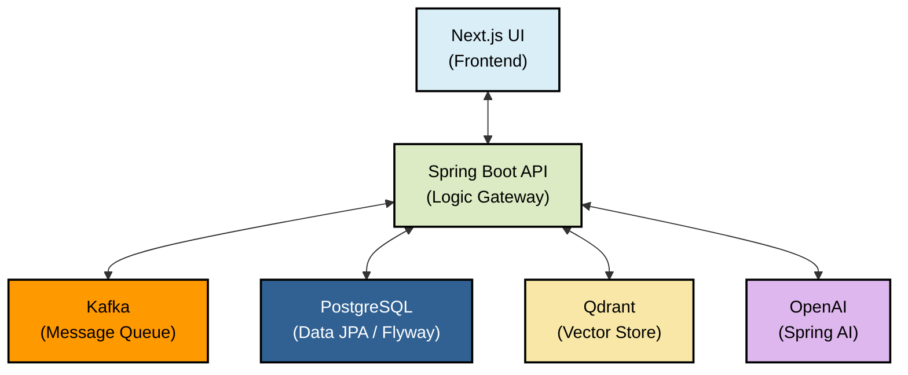
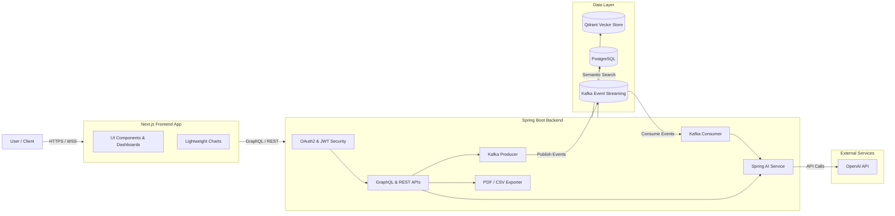

# Quant Edge

<p align="center">
  
  
  
  
  
  
  
  
</p>

## 🚀 Overview

**Quant Edge** is an AI-powered financial and portfolio management platform. It leverages large language models (LLMs) and Retrieval-Augmented Generation (RAG) to provide intelligent insights, real-time market data integration, and comprehensive portfolio reporting. The platform features a highly scalable microservice-oriented architecture with event-driven data streaming.

## ✨ Key Features

- **AI-Driven Insights**: Powered by Spring AI and OpenAI for intelligent chat, financial analysis, and personalized insights.
- **Market Data Integration**: Connects with leading financial APIs (Finnhub, Twelve Data, Alpha Vantage) for real-time and historical market data.
- **Event-Driven Architecture**: Utilizes Apache Kafka for robust asynchronous event processing and message brokering.
- **Advanced Semantic Search**: Employs Qdrant as a vector database for embedding storage, supporting high-performance RAG workflows.
- **Secure Authentication**: Implements Spring Security with OAuth2 (Google) and JWT for stateless authentication.
- **Comprehensive Reporting**: Generates downloadable portfolio and tax reports via iText7 (PDF) and trade histories via OpenCSV.

## 🛠️ Prerequisites

- **Java 21**
- **Node.js 20+**
- **Docker & Docker Compose** (for spinning up local database, cache, and messaging infrastructure)

## 🚀 Getting Started

### 1. Start Infrastructure Services

Use Docker Compose to spin up the required local infrastructure (PostgreSQL, Redis via Serverless HTTP, Zookeeper, and Kafka):

```bash
docker-compose --profile local up -d
```

### 2. Environment Configuration

Create a `.env` file in the root directory (use `.env.example` as a template). You'll need to configure key variables such as:

- **Database:** `DATABASE_URL`, `DATABASE_USERNAME`, `DATABASE_PASSWORD`
- **Redis (Upstash/Local):** `UPSTASH_REDIS_REST_URL`, `UPSTASH_REDIS_REST_TOKEN`
- **External APIs:** `FINNHUB_API_KEY`, `TWELVE_DATA_API_KEY`, `ALPHA_VANTAGE_API_KEY`, `GROQ_API_KEY`
- **Vector Store:** `QDRANT_URL`, `QDRANT_API_KEY`
- **Auth:** `GOOGLE_CLIENT_ID`, `GOOGLE_CLIENT_SECRET`, `JWT_ACCESS_SECRET`

### 3. Run the Application

#### Windows (Quick Start)

A convenient startup script is provided for Windows environments that will launch both the frontend and backend simultaneously:

```bat
start.bat
```

#### Manual Startup

- **Backend**:

  ```bash
  cd backend
  ./mvnw spring-boot:run
  ```

  _The backend API will be available at `http://localhost:8080`_

- **Frontend**:
  ```bash
  cd frontend
  npm install
  npm run dev
  ```
  _The frontend UI will be available at `http://localhost:3000`_

---

## ✨ Component Interaction



## ✨ Architecture Design



## ✨ Tech Stack

<div align="center">

<table>
  <tr>
    <th width="55%">Layer</th>
    <th width="45%">Technology</th>
  </tr>

  <tr>
    <td><b>Frontend Framework</b></td>
    <td>Next.js (App Router / Turbopack)</td>
  </tr>

  <tr>
    <td><b>Frontend Language</b></td>
    <td>TypeScript</td>
  </tr>

  <tr>
    <td><b>CSS</b></td>
    <td>Tailwind CSS</td>
  </tr>

  <tr>
    <td><b>Charts</b></td>
    <td>Lightweight Charts</td>
  </tr>

  <tr>
    <td><b>State Management</b></td>
    <td>React Query (TanStack)</td>
  </tr>

  <tr>
    <td><b>Animations</b></td>
    <td>Framer Motion</td>
  </tr>

  <tr>
    <td><b>Backend Framework</b></td>
    <td>Spring Boot</td>
  </tr>

  <tr>
    <td><b>Backend Language</b></td>
    <td>Java</td>
  </tr>

  <tr>
    <td><b>API Layer</b></td>
    <td>GraphQL + WebMVC</td>
  </tr>

  <tr>
    <td><b>AI Framework</b></td>
    <td>Spring AI</td>
  </tr>

  <tr>
    <td><b>Security / Auth</b></td>
    <td>Spring Security, OAuth2, JJWT</td>
  </tr>

  <tr>
    <td><b>Database</b></td>
    <td>PostgreSQL (Data JPA + Flyway)</td>
  </tr>

  <tr>
    <td><b>Vector Store</b></td>
    <td>Qdrant</td>
  </tr>

  <tr>
    <td><b>Message Broker</b></td>
    <td>Kafka</td>
  </tr>

  <tr>
    <td><b>LLM Provider</b></td>
    <td>OpenAI API</td>
  </tr>

  <tr>
    <td><b>File Exports</b></td>
    <td>iText7 (PDF), OpenCSV (CSV)</td>
  </tr>

  <tr>
    <td><b>Testing</b></td>
    <td>JUnit, Testcontainers, Jacoco</td>
  </tr>

</table>

</div>
