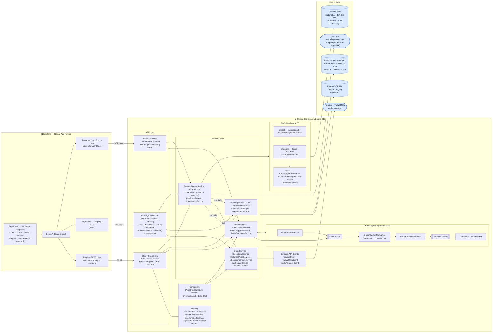

AI-powered stock research and simulated trading platform, quantified.


See [CLAUDE.md](./CLAUDE.md) for the full project spec, tech stack, and workflow rules.

## Overview

QuantEdge lets a user research a company (profile, price chart, news, technical indicators),
hold a simulated portfolio, and place market/limit/stop orders against a real matching engine —
with a GenAI research agent that can answer questions grounded in the platform's own data.

- **Auth** — JWT access/refresh tokens (rotation + reuse detection), Google OAuth2
- **Research** — company profiles, charts, news, indicators, cached in Redis on top of
  Finnhub / Twelve Data / Alpha Vantage
- **Trading** — simulated portfolios, market/limit/stop-loss/stop-limit orders, a Kafka-driven
  matching engine, SSE fill notifications
- **Standout features** — AOP audit log, company comparison, portfolio time machine, PDF/CSV
  exports
- **GenAI agent** — Spring AI over Groq, a 9-tool research agent with an SSE reasoning trace,
  RAG over a Qdrant-backed knowledge base (news + research notes)

## Architecture



- Kafka never reaches the frontend — it is strictly internal to the backend (price events in,
  matching engine, executed-trade events out).
- **REST** handles writes (auth, orders, exports, chat/agent triggers), **GraphQL** handles reads
  (portfolio, dashboard, comparisons, timelines), **SSE** handles push (order fills, agent
  reasoning trace) — see
  [CLAUDE.md § API Design Rules](./CLAUDE.md#api-design-rules) for the rules behind that split.
- The GenAI research agent (`ChatTools`) calls back into the same trading/research services as a
  set of 10 `@Tool`-annotated methods, and separately grounds itself via the RAG pipeline over a
  Qdrant-backed knowledge base of news + research notes.

## Local Setup

**Prerequisites:** Node.js 20+, Java 21, Maven (or use the bundled `./mvnw`), Docker + Docker
Compose. Optional for hosted mode: a Neon Postgres URL, an Upstash Redis REST endpoint, and API
keys for Finnhub / Twelve Data / Alpha Vantage / Groq / Qdrant Cloud.

After cloning, run these once from the repo root:

```bash
npm install          # installs lefthook, commitlint, prettier at root
                      # and auto-runs `lefthook install` via postinstall
cd frontend && npm install
cd ../backend && ./mvnw -q -DskipTests install
```

This wires up the git hooks (pre-commit formatting, commit-msg linting,
pre-push checks) documented in [CLAUDE.md § Tooling](./CLAUDE.md#tooling).

If `npm install` reports pending install scripts under `npm warn allow-scripts`,
approve lefthook's postinstall so hooks actually get installed:

```bash
npm approve-scripts lefthook
```

Copy `.env.example` to `.env` and fill in any keys you need (everything has a Docker-friendly
local default — see [docs/docker.md](./docs/docker.md)):

```bash
cp .env.example .env
```

### Run everything with Docker

```bash
docker compose --profile local up --build
```

See [docs/docker.md](./docs/docker.md) for the full local-stack vs. hosted-infra modes
(`docker compose --profile local up --build` vs. `docker compose up backend frontend --build`).

### Run the backend directly

```bash
cd backend
./mvnw spring-boot:run   # http://localhost:8080, health: /actuator/health
./mvnw test               # fast unit tests (H2, no Testcontainers)
./mvnw verify              # full build: tests + Spotless + Checkstyle + JaCoCo 80% coverage gate
```

Coverage report after `./mvnw verify`: `backend/target/site/jacoco/index.html`.

### Run the frontend directly

```bash
cd frontend
npm run dev      # http://localhost:3000
npm run lint
npm run typecheck
```

## API Overview

REST for writes, GraphQL for reads, SSE for push — see
[docs/api-contract.md](./docs/api-contract.md) for the full endpoint-by-endpoint contract, and
[CLAUDE.md § API Design Rules](./CLAUDE.md#api-design-rules) for the rules behind that split.

## Retrieval Evaluation

Phase 5's RAG layer (`backend/src/main/java/com/quantedge/backend/rag`) grounds the chat agent's
`queryKnowledgeBase` tool in a Qdrant Cloud vector store over a **frozen fixture corpus**: 20 news
articles + 14 research notes (`backend/src/main/resources/rag/*.json`), chosen frozen rather than
live so the gold-set labels below stay valid across runs. Embeddings are local ONNX
`all-MiniLM-L6-v2` (384-dim) — Groq has no embeddings endpoint, so chat and embeddings
intentionally use different models.

**Gold set**: 50 hand-labeled question → source-document pairs
(`backend/src/main/resources/rag/gold_set.json`), 30 from the news corpus and 20 from the
research-notes corpus, one gold document per question. Reproduce any row with:

```bash
cd backend
./mvnw -q compile -DskipTests
./mvnw -q dependency:build-classpath -Dmdep.outputFile=/tmp/cp.txt
java -cp "target/classes;$(cat /tmp/cp.txt)" com.quantedge.backend.rag.eval.EvalRunner \
    <FIXED|RECURSIVE|SEMANTIC> <hybrid true|false> <rerank true|false> [chunkSize=800] [chunkOverlap=120]
```

Requires `QDRANT_URL` / `QDRANT_API_KEY` env vars always, and `GROQ_API_KEY` / `GROQ_MODEL` only
for `rerank=true` runs. Each run ingests the corpus into its own Qdrant collection
(`quantedge_eval_<label>`), so combos never contaminate each other, and scores Recall@1/5/10 and
MRR (`EvalMetrics`) against the gold set.

| Config (chunking / rerank / retrieval mode / embedding model)  | Recall@1 | Recall@5 | Recall@10 | MRR   | Notes                                                                                                                                                                                                                                                                                                                                                                                                                                                                                |
| -------------------------------------------------------------- | -------- | -------- | --------- | ----- | ------------------------------------------------------------------------------------------------------------------------------------------------------------------------------------------------------------------------------------------------------------------------------------------------------------------------------------------------------------------------------------------------------------------------------------------------------------------------------------ |
| FIXED / no-rerank / dense / all-MiniLM-L6-v2 (baseline)        | 0.900    | 1.000    | 1.000     | 0.950 |                                                                                                                                                                                                                                                                                                                                                                                                                                                                                      |
| RECURSIVE / no-rerank / dense / all-MiniLM-L6-v2               | 0.900    | 1.000    | 1.000     | 0.950 | Same as fixed-size at this corpus size — see Notes below the table.                                                                                                                                                                                                                                                                                                                                                                                                                  |
| SEMANTIC / no-rerank / dense / all-MiniLM-L6-v2                | 0.900    | 1.000    | 1.000     | 0.950 | Produced 45 chunks vs 34 for fixed/recursive (finer-grained splits); no recall change at this corpus size.                                                                                                                                                                                                                                                                                                                                                                           |
| RECURSIVE / no-rerank / hybrid (dense+BM25) / all-MiniLM-L6-v2 | 0.900    | 1.000    | 1.000     | 0.950 | RRF fusion of dense + in-memory BM25; no change over dense-only here.                                                                                                                                                                                                                                                                                                                                                                                                                |
| RECURSIVE / llm-rerank / dense / all-MiniLM-L6-v2              | —        | —        | —         | —     | Omitted: free-tier Groq rate limits (30 RPM) made this impractical for batch eval — the harness's LLM-rerank pass makes one Groq call per query, and 50 sequential calls stalled out on rate-limit backoff even after throttling to ~24/min. The code path (`LlmRerankService`, wired into `EvalRunner`/`KnowledgeBaseService`) is implemented and reachable via the reproduce command above with `rerank=true`; it just wasn't practical to run for the full gold set on this tier. |

**Why every dense/hybrid row is nearly identical**: the corpus is intentionally small (34–45
chunks across 34 source documents) and the gold questions are each answerable from one
clearly-distinguishable document, so dense retrieval alone already saturates Recall@5/@10 at
1.000 — there's no room left for chunking or hybrid retrieval to improve on. The one consistent
miss (Recall@1 = 0.900, 5/50 questions) is a technique-independent ceiling: those 5 questions each
have a close semantic competitor among the other documents that occasionally out-scores the
correct one for the #1 spot, not something any of these techniques fixes at this scale. This is an
honest negative result, kept in the table rather than omitted, per this harness's rule against
only reporting positive deltas. A larger, noisier corpus (e.g. full live news volume) is where
these techniques would be expected to actually differentiate.

**LLM rerank note**: `LlmRerankService` reranks candidates by asking the Groq chat model to order
them by relevance in a single prompt (not a dedicated cross-encoder - none is available in this
Java stack without a new heavyweight dependency), labeled "llm-rerank" rather than "cross-encoder"
in the table above for that reason.
