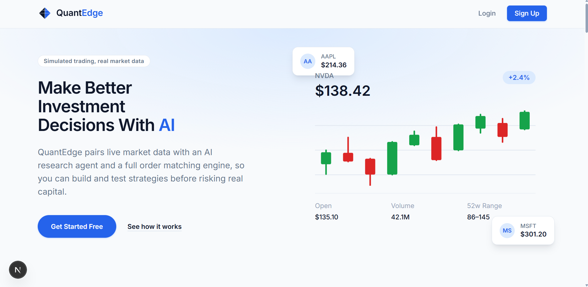
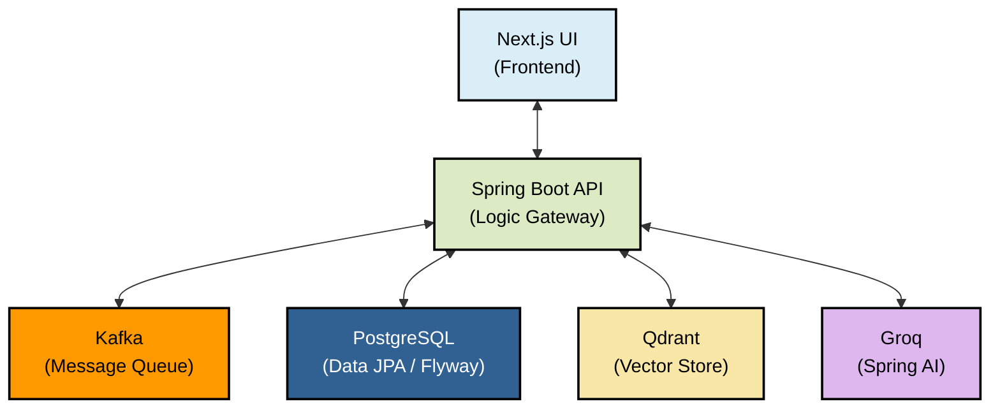
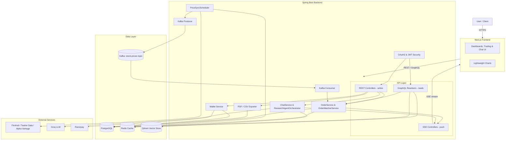
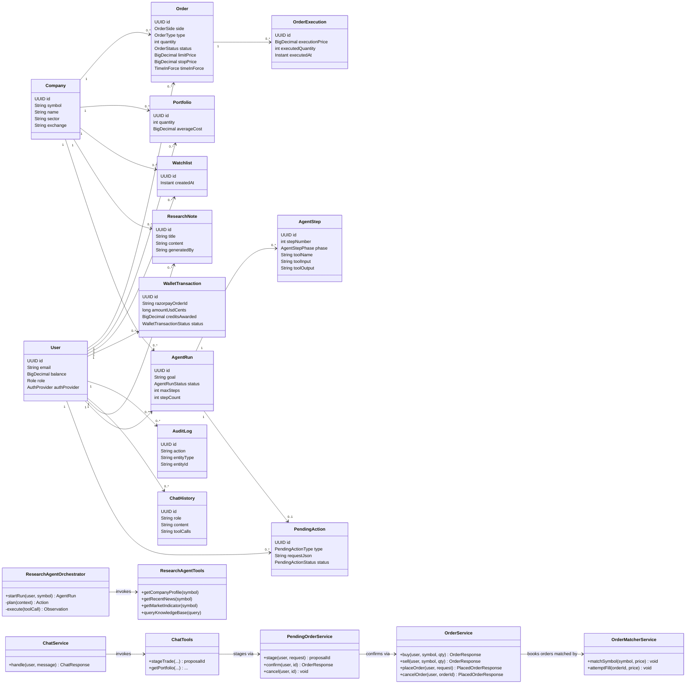
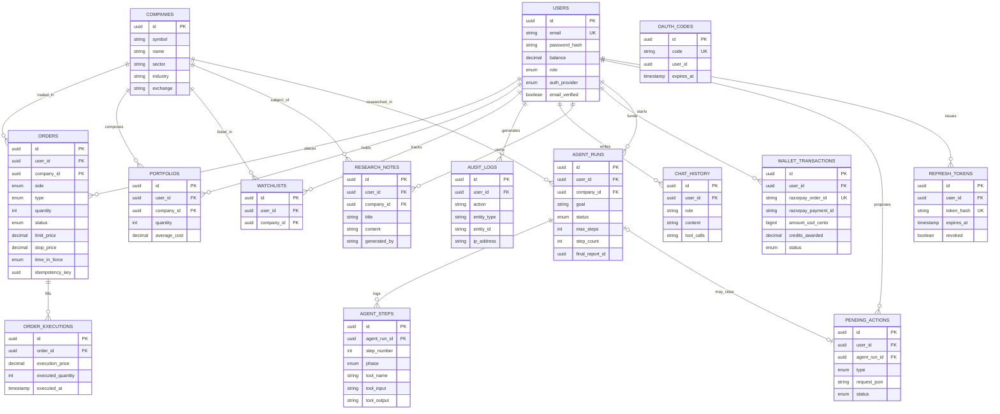
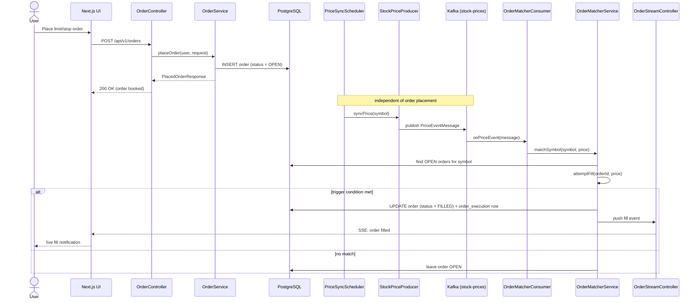
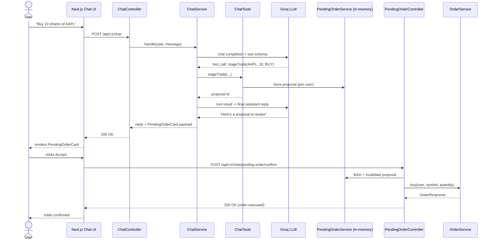
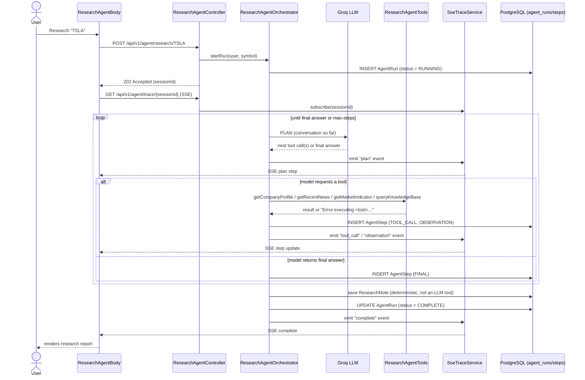
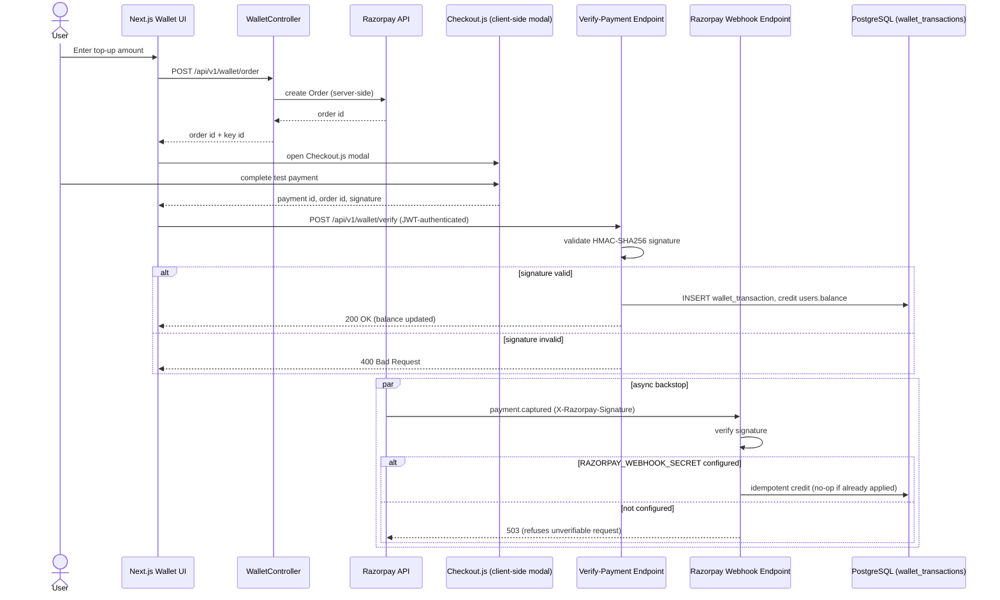
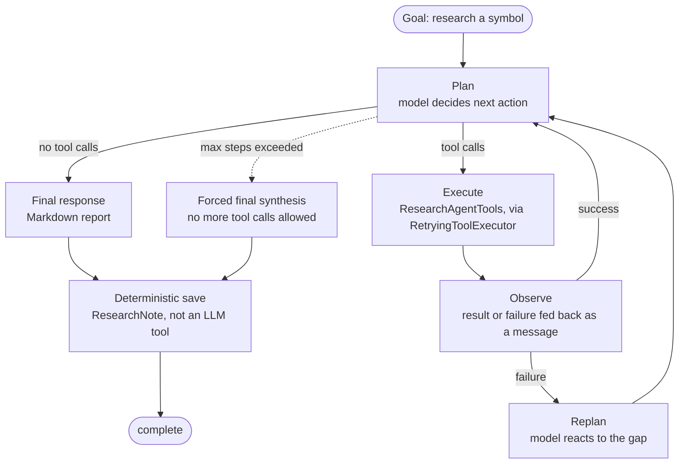

#  Quant Edge

<p align="center">
  
</p>

<p align="center">
  
  
  
  
  
  
  
  
</p>

<p align="center"><i>AI-powered stock research and simulated trading — quantified.</i></p>

## Contents

- [Overview](#overview)
- [Key Features](#key-features)
- [Tech Stack](#tech-stack)
- [Architecture](#architecture)
- [Domain Model](#domain-model)
- [Key Data Flows](#key-data-flows)
- [AI / Agentic Architecture](#ai--agentic-architecture)
- [API Surface](#api-surface)
- [Getting Started](#getting-started)
- [Testing](#testing)

## Overview

**Quant Edge** is an AI-powered stock research and simulated trading platform. It combines live
market data, a limit/stop order matching engine, and two purpose-built LLM surfaces — a
tool-calling chat assistant and a multi-step research agent with its own plan/act/observe loop —
to help a user research a symbol, place simulated trades, and track a virtual portfolio.

Reads go through GraphQL, writes go through REST, and fills/agent progress stream over SSE; Kafka
carries order-matching events internally and is never touched by the frontend.

## Key Features

- **Simulated trading & order matching** — market, limit, stop-loss, and stop-limit orders against
  a Kafka-backed matching engine, with live fill notifications pushed over SSE
  (`OrderStreamController`).
- **AI chat assistant** — a single-turn, tool-calling assistant (`ChatService`) over the user's
  portfolio, watchlist, order history, and RAG search; it can _stage_ a trade proposal but never
  execute one — only an explicit Accept click on the `PendingOrderCard` confirms it.
- **Research agent** — a multi-step plan/act/observe agent (`ResearchAgentOrchestrator`) that
  decides for itself which read-only tools to call (company profile, news, indicators,
  knowledge-base RAG search) for a given symbol, with guardrails on step count, per-tool
  timeout/retries, and wall-clock budget, and a live SSE reasoning trace.
- **Retrieval-augmented knowledge base** — daily Finnhub news and company data embedded locally
  (ONNX MiniLM) and stored in Qdrant, queried by both AI surfaces as a normal tool call.
- **Portfolio tools** — dashboard, watchlist with live quotes, stock comparison, an audit log (via
  AOP), a "time machine" portfolio replay, and PDF/CSV exports (iText7 / OpenCSV).
- **Simulated wallet top-up** — Razorpay Checkout (Test Mode) funds a virtual balance at a fixed
  $1 = 10 credits rate; no real money ever moves. HMAC-verified server-side, backed by an
  idempotent webhook.
- **Secure auth** — Spring Security with Google OAuth2 and JWT access/refresh tokens.
- **Cache-first data layer** — Redis-backed caching (prices, charts, news, indicators, profiles) in
  front of Finnhub / Twelve Data / Alpha Vantage, so ~90% of page loads never hit an external API.

## Tech Stack

<div align="center">

<table>
  <tr>
    <th width="30%">Layer</th>
    <th width="70%">Technology</th>
  </tr>
  <tr><td><b>Frontend Framework</b></td><td>Next.js (App Router / Turbopack)</td></tr>
  <tr><td><b>Frontend Language</b></td><td>TypeScript</td></tr>
  <tr><td><b>CSS</b></td><td>Tailwind CSS, shadcn/ui</td></tr>
  <tr><td><b>Charts</b></td><td>TradingView Lightweight Charts</td></tr>
  <tr><td><b>State Management</b></td><td>React Query (TanStack)</td></tr>
  <tr><td><b>Animations</b></td><td>Framer Motion</td></tr>
  <tr><td><b>Backend Framework</b></td><td>Spring Boot</td></tr>
  <tr><td><b>Backend Language</b></td><td>Java 21</td></tr>
  <tr><td><b>API Layer</b></td><td>GraphQL (reads) + Spring MVC / REST (writes) + SSE (push)</td></tr>
  <tr><td><b>AI Framework</b></td><td>Spring AI</td></tr>
  <tr><td><b>LLM Provider</b></td><td>Groq (via Spring AI's OpenAI-compatible client)</td></tr>
  <tr><td><b>Vector Store</b></td><td>Qdrant</td></tr>
  <tr><td><b>Embeddings</b></td><td>Local ONNX (all-MiniLM-L6-v2) — Groq has no embeddings endpoint</td></tr>
  <tr><td><b>Message Broker</b></td><td>Apache Kafka</td></tr>
  <tr><td><b>Database</b></td><td>PostgreSQL (Spring Data JPA + Flyway migrations)</td></tr>
  <tr><td><b>Cache</b></td><td>Redis (Upstash REST-compatible)</td></tr>
  <tr><td><b>Security / Auth</b></td><td>Spring Security, Google OAuth2, JJWT</td></tr>
  <tr><td><b>Payments</b></td><td>Razorpay Checkout.js (Test Mode, wallet top-up only)</td></tr>
  <tr><td><b>File Exports</b></td><td>iText7 (PDF), OpenCSV (CSV)</td></tr>
  <tr><td><b>Testing</b></td><td>JUnit, Mockito, Testcontainers, Jacoco</td></tr>
  <tr><td><b>DevOps</b></td><td>Docker Compose</td></tr>
</table>

</div>

## Architecture

### Component Interaction


```mermaid
flowchart TB
    UI["Next.js UI<br/>(Frontend)"]
    API["Spring Boot API<br/>(Logic Gateway)"]
    Kafka["Kafka<br/>(Message Queue)"]
    DB["PostgreSQL<br/>(Data JPA / Flyway)"]
    Qdrant["Qdrant<br/>(Vector Store)"]
    LLM["Groq<br/>(Spring AI)"]

    UI <--> API
    API <--> Kafka
    API <--> DB
    API <--> Qdrant
    API <--> LLM

    style UI fill:#D9EEF7,stroke:#000,stroke-width:2px,color:#000
    style API fill:#DCEBC3,stroke:#000,stroke-width:2px,color:#000
    style Kafka fill:#FF9900,stroke:#000,stroke-width:2px,color:#000
    style DB fill:#316192,stroke:#000,stroke-width:2px,color:#FFF
    style Qdrant fill:#F8E7A6,stroke:#000,stroke-width:2px,color:#000
    style LLM fill:#DDB7ED,stroke:#000,stroke-width:2px,color:#000
```

### Layered Design


```mermaid
flowchart TB
    U["User / Client"]

    subgraph F["Next.js Frontend"]
        UI["Dashboards, Trading & Chat UI"]
        Charts["Lightweight Charts"]
    end

    subgraph B["Spring Boot Backend"]
        SEC["OAuth2 & JWT Security"]

        subgraph API["API Layer"]
            REST["REST Controllers - writes"]
            GQL["GraphQL Resolvers - reads"]
            SSE["SSE Controllers - push"]
        end

        ORD["OrderService & OrderMatcherService"]
        AI["ChatService & ResearchAgentOrchestrator"]
        EXP["PDF / CSV Exporter"]
        WAL["Wallet Service"]
        SCHED["PriceSyncScheduler"]
        KFP["Kafka Producer"]
        KFC["Kafka Consumer"]

        SEC --> REST
        SEC --> GQL
        REST --> ORD
        REST --> AI
        REST --> EXP
        REST --> WAL
        GQL --> ORD
        SCHED --> KFP
        KFC --> ORD
        ORD --> SSE
        AI --> SSE
    end

    subgraph D["Data Layer"]
        PG[("PostgreSQL")]
        RD[("Redis Cache")]
        QD[("Qdrant Vector Store")]
        KT[("Kafka: stock-prices topic")]
    end

    subgraph Ext["External Services"]
        MKT["Finnhub / Twelve Data / Alpha Vantage"]
        GROQ["Groq LLM"]
        RZP["Razorpay"]
    end

    U -->|"HTTPS"| F
    F -->|"REST / GraphQL"| API
    SSE -->|"SSE stream"| F

    ORD --> PG
    ORD --> RD
    GQL --> PG
    GQL --> RD
    EXP --> PG
    WAL --> PG
    AI --> QD
    AI --> GROQ
    WAL --> RZP
    SCHED --> MKT
    SCHED --> RD
    KFP --> KT
    KT --> KFC
```

## Domain Model

### Class Diagram

Simplified view of the core domain — request/response DTOs, mappers, and repositories are
omitted for clarity. Full detail lives under `backend/src/main/java/com/quantedge/backend/`.


```mermaid
classDiagram
    direction LR

    class User {
        UUID id
        String email
        BigDecimal balance
        Role role
        AuthProvider authProvider
    }

    class Company {
        UUID id
        String symbol
        String name
        String sector
        String exchange
    }

    class Portfolio {
        UUID id
        int quantity
        BigDecimal averageCost
    }

    class Order {
        UUID id
        OrderSide side
        OrderType type
        int quantity
        OrderStatus status
        BigDecimal limitPrice
        BigDecimal stopPrice
        TimeInForce timeInForce
    }

    class OrderExecution {
        UUID id
        BigDecimal executionPrice
        int executedQuantity
        Instant executedAt
    }

    class Watchlist {
        UUID id
        Instant createdAt
    }

    class WalletTransaction {
        UUID id
        String razorpayOrderId
        long amountUsdCents
        BigDecimal creditsAwarded
        WalletTransactionStatus status
    }

    class AuditLog {
        UUID id
        String action
        String entityType
        String entityId
    }

    class ChatHistory {
        UUID id
        String role
        String content
        String toolCalls
    }

    class ResearchNote {
        UUID id
        String title
        String content
        String generatedBy
    }

    class AgentRun {
        UUID id
        String goal
        AgentRunStatus status
        int maxSteps
        int stepCount
    }

    class AgentStep {
        UUID id
        int stepNumber
        AgentStepPhase phase
        String toolName
        String toolInput
        String toolOutput
    }

    class PendingAction {
        UUID id
        PendingActionType type
        String requestJson
        PendingActionStatus status
    }

    class OrderService {
        +buy(user, symbol, qty) OrderResponse
        +sell(user, symbol, qty) OrderResponse
        +placeOrder(user, request) PlacedOrderResponse
        +cancelOrder(user, orderId) PlacedOrderResponse
    }

    class OrderMatcherService {
        +matchSymbol(symbol, price) void
        +attemptFill(orderId, price) void
    }

    class ChatService {
        +handle(user, message) ChatResponse
    }

    class ChatTools {
        +stageTrade(...) proposalId
        +getPortfolio(...) ...
    }

    class PendingOrderService {
        +stage(user, request) proposalId
        +confirm(user, id) OrderResponse
        +cancel(user, id) void
    }

    class ResearchAgentOrchestrator {
        +startRun(user, symbol) AgentRun
        -plan(context) Action
        -execute(toolCall) Observation
    }

    class ResearchAgentTools {
        +getCompanyProfile(symbol)
        +getRecentNews(symbol)
        +getMarketIndicator(symbol)
        +queryKnowledgeBase(query)
    }

    User "1" --> "0..*" Order
    User "1" --> "0..*" Portfolio
    User "1" --> "0..*" Watchlist
    User "1" --> "0..*" WalletTransaction
    User "1" --> "0..*" AuditLog
    User "1" --> "0..*" ChatHistory
    User "1" --> "0..*" ResearchNote
    User "1" --> "0..*" AgentRun
    User "1" --> "0..*" PendingAction

    Company "1" --> "0..*" Order
    Company "1" --> "0..*" Portfolio
    Company "1" --> "0..*" Watchlist
    Company "1" --> "0..*" ResearchNote
    Company "1" --> "0..*" AgentRun

    Order "1" --> "0..*" OrderExecution
    AgentRun "1" --> "0..*" AgentStep
    AgentRun "1" --> "0..1" PendingAction

    OrderService --> OrderMatcherService : books orders matched by
    ChatService --> ChatTools : invokes
    ChatTools --> PendingOrderService : stages via
    PendingOrderService --> OrderService : confirms via
    ResearchAgentOrchestrator --> ResearchAgentTools : invokes
```

### Entity-Relationship Diagram

15 tables across four concerns: identity/auth, trading, AI surfaces, and payments.


```mermaid
erDiagram
    USERS ||--o{ ORDERS : places
    USERS ||--o{ PORTFOLIOS : holds
    USERS ||--o{ WATCHLISTS : tracks
    USERS ||--o{ AUDIT_LOGS : generates
    USERS ||--o{ CHAT_HISTORY : writes
    USERS ||--o{ RESEARCH_NOTES : owns
    USERS ||--o{ WALLET_TRANSACTIONS : funds
    USERS ||--o{ AGENT_RUNS : starts
    USERS ||--o{ PENDING_ACTIONS : proposes
    USERS ||--o{ REFRESH_TOKENS : issues

    COMPANIES ||--o{ ORDERS : traded_in
    COMPANIES ||--o{ PORTFOLIOS : composes
    COMPANIES ||--o{ WATCHLISTS : listed_in
    COMPANIES ||--o{ RESEARCH_NOTES : subject_of
    COMPANIES ||--o{ AGENT_RUNS : researched_in

    ORDERS ||--o{ ORDER_EXECUTIONS : fills

    AGENT_RUNS ||--o{ AGENT_STEPS : logs
    AGENT_RUNS |o--o| PENDING_ACTIONS : may_raise

    USERS {
        uuid id PK
        string email UK
        string password_hash
        decimal balance
        enum role
        enum auth_provider
        boolean email_verified
    }

    COMPANIES {
        uuid id PK
        string symbol
        string name
        string sector
        string industry
        string exchange
    }

    PORTFOLIOS {
        uuid id PK
        uuid user_id FK
        uuid company_id FK
        int quantity
        decimal average_cost
    }

    ORDERS {
        uuid id PK
        uuid user_id FK
        uuid company_id FK
        enum side
        enum type
        int quantity
        enum status
        decimal limit_price
        decimal stop_price
        enum time_in_force
        uuid idempotency_key
    }

    ORDER_EXECUTIONS {
        uuid id PK
        uuid order_id FK
        decimal execution_price
        int executed_quantity
        timestamp executed_at
    }

    WATCHLISTS {
        uuid id PK
        uuid user_id FK
        uuid company_id FK
    }

    AUDIT_LOGS {
        uuid id PK
        uuid user_id FK
        string action
        string entity_type
        string entity_id
        string ip_address
    }

    CHAT_HISTORY {
        uuid id PK
        uuid user_id FK
        string role
        string content
        string tool_calls
    }

    RESEARCH_NOTES {
        uuid id PK
        uuid user_id FK
        uuid company_id FK
        string title
        string content
        string generated_by
    }

    AGENT_RUNS {
        uuid id PK
        uuid user_id FK
        uuid company_id FK
        string goal
        enum status
        int max_steps
        int step_count
        uuid final_report_id
    }

    AGENT_STEPS {
        uuid id PK
        uuid agent_run_id FK
        int step_number
        enum phase
        string tool_name
        string tool_input
        string tool_output
    }

    PENDING_ACTIONS {
        uuid id PK
        uuid user_id FK
        uuid agent_run_id FK
        enum type
        string request_json
        enum status
    }

    WALLET_TRANSACTIONS {
        uuid id PK
        uuid user_id FK
        string razorpay_order_id UK
        string razorpay_payment_id
        bigint amount_usd_cents
        decimal credits_awarded
        enum status
    }

    REFRESH_TOKENS {
        uuid id PK
        uuid user_id FK
        string token_hash UK
        timestamp expires_at
        boolean revoked
    }

    OAUTH_CODES {
        uuid id PK
        string code UK
        uuid user_id
        timestamp expires_at
    }
```

## Key Data Flows

Sequence diagrams for the platform's four core end-to-end interactions.

### 1. Order Placement & Matching (SSE fill notification)

Orders are matched asynchronously against periodic price syncs, not synchronously at placement
time — placing a limit/stop order only ever books it; a fill happens later, whenever a price event
crosses the order's trigger.


```mermaid
sequenceDiagram
    actor User
    participant UI as Next.js UI
    participant API as OrderController
    participant Svc as OrderService
    participant DB as PostgreSQL
    participant Sched as PriceSyncScheduler
    participant Prod as StockPriceProducer
    participant Kafka as Kafka (stock-prices)
    participant Cons as OrderMatcherConsumer
    participant Match as OrderMatcherService
    participant Stream as OrderStreamController

    User->>UI: Place limit/stop order
    UI->>API: POST /api/v1/orders
    API->>Svc: placeOrder(user, request)
    Svc->>DB: INSERT order (status = OPEN)
    Svc-->>API: PlacedOrderResponse
    API-->>UI: 200 OK (order booked)

    Note over Sched,Kafka: independent of order placement
    Sched->>Prod: syncPrice(symbol)
    Prod->>Kafka: publish PriceEventMessage
    Kafka->>Cons: onPriceEvent(message)
    Cons->>Match: matchSymbol(symbol, price)
    Match->>DB: find OPEN orders for symbol
    Match->>Match: attemptFill(orderId, price)
    alt trigger condition met
        Match->>DB: UPDATE order (status = FILLED) + order_execution row
        Match->>Stream: push fill event
        Stream-->>UI: SSE: order filled
        UI-->>User: live fill notification
    else no match
        Match->>DB: leave order OPEN
    end
```

### 2. AI Chat — Trade Proposal Staging & Confirmation

The LLM can only **stage** a trade; execution requires a real authenticated HTTP request the user
triggers by clicking Accept — the model can never confirm a trade on its own.


```mermaid
sequenceDiagram
    actor User
    participant UI as Next.js Chat UI
    participant API as ChatController
    participant Svc as ChatService
    participant Tools as ChatTools
    participant Groq as Groq LLM
    participant Pending as PendingOrderService (in-memory)
    participant Confirm as PendingOrderController
    participant OrderSvc as OrderService

    User->>UI: "Buy 10 shares of AAPL"
    UI->>API: POST /api/v1/chat
    API->>Svc: handle(user, message)
    Svc->>Groq: chat completion + tool schema
    Groq-->>Svc: tool_call: stageTrade(AAPL, 10, BUY)
    Svc->>Tools: stageTrade(...)
    Tools->>Pending: store proposal (per-user)
    Tools-->>Svc: proposal id
    Svc->>Groq: tool result -> final assistant reply
    Groq-->>Svc: "Here's a proposal to review"
    Svc-->>API: reply + PendingOrderCard payload
    API-->>UI: 200 OK
    UI-->>User: renders PendingOrderCard

    User->>UI: clicks Accept
    UI->>Confirm: POST /api/v1/chat/pending-order/confirm
    Confirm->>Pending: fetch + invalidate proposal
    Confirm->>OrderSvc: buy(user, symbol, quantity)
    OrderSvc-->>Confirm: OrderResponse
    Confirm-->>UI: 200 OK (order executed)
    UI-->>User: trade confirmed
```

### 3. Research Agent Run (plan/act/observe, live SSE trace)

The agent loops on its own until it decides it has enough information, subject to the guardrails
in [AI / Agentic Architecture](#ai--agentic-architecture).


```mermaid
sequenceDiagram
    actor User
    participant UI as ResearchAgentBody
    participant API as ResearchAgentController
    participant Orc as ResearchAgentOrchestrator
    participant Groq as Groq LLM
    participant Tools as ResearchAgentTools
    participant Trace as SseTraceService
    participant DB as PostgreSQL (agent_runs/steps)

    User->>UI: Research "TSLA"
    UI->>API: POST /api/v1/agent/research/TSLA
    API->>Orc: startRun(user, symbol)
    Orc->>DB: INSERT AgentRun (status = RUNNING)
    API-->>UI: 202 Accepted (sessionId)
    UI->>API: GET /api/v1/agent/trace/{sessionId} (SSE)
    API->>Trace: subscribe(sessionId)

    loop until final answer or max-steps
        Orc->>Groq: PLAN (conversation so far)
        Groq-->>Orc: next tool call(s) or final answer
        Orc->>Trace: emit "plan" event
        Trace-->>UI: SSE plan step

        alt model requests a tool
            Orc->>Tools: getCompanyProfile / getRecentNews / getMarketIndicator / queryKnowledgeBase
            Tools-->>Orc: result or "Error executing <tool>..."
            Orc->>DB: INSERT AgentStep (TOOL_CALL, OBSERVATION)
            Orc->>Trace: emit "tool_call" / "observation" event
            Trace-->>UI: SSE step update
        else model returns final answer
            Orc->>DB: INSERT AgentStep (FINAL)
        end
    end

    Orc->>DB: save ResearchNote (deterministic, not an LLM tool)
    Orc->>DB: UPDATE AgentRun (status = COMPLETE)
    Orc->>Trace: emit "complete" event
    Trace-->>UI: SSE complete
    UI-->>User: renders research report
```

### 4. Wallet Top-Up (Razorpay Checkout, Test Mode)

No real money moves — Razorpay Test Mode issues a virtual authorization that credits the user's
in-app balance at $1 = 10 credits, verified twice: once synchronously via HMAC signature, once
idempotently via webhook as a backstop.


```mermaid
sequenceDiagram
    actor User
    participant UI as Next.js Wallet UI
    participant API as WalletController
    participant Razorpay as Razorpay API
    participant Checkout as Checkout.js (client-side modal)
    participant Verify as Verify-Payment Endpoint
    participant Webhook as Razorpay Webhook Endpoint
    participant DB as PostgreSQL (wallet_transactions)

    User->>UI: Enter top-up amount
    UI->>API: POST /api/v1/wallet/order
    API->>Razorpay: create Order (server-side)
    Razorpay-->>API: order id
    API-->>UI: order id + key id
    UI->>Checkout: open Checkout.js modal
    User->>Checkout: complete test payment
    Checkout-->>UI: payment id, order id, signature

    UI->>Verify: POST /api/v1/wallet/verify (JWT-authenticated)
    Verify->>Verify: validate HMAC-SHA256 signature
    alt signature valid
        Verify->>DB: INSERT wallet_transaction, credit users.balance
        Verify-->>UI: 200 OK (balance updated)
    else signature invalid
        Verify-->>UI: 400 Bad Request
    end

    par async backstop
        Razorpay->>Webhook: payment.captured (X-Razorpay-Signature)
        Webhook->>Webhook: verify signature
        alt RAZORPAY_WEBHOOK_SECRET configured
            Webhook->>DB: idempotent credit (no-op if already applied)
        else not configured
            Webhook-->>Razorpay: 503 (refuses unverifiable request)
        end
    end
```

## AI / Agentic Architecture

QuantEdge has two distinct AI surfaces built on Spring AI + Groq (OpenAI-compatible client) +
Qdrant. They are deliberately separate rather than one shared code path:

- **Chat assistant** (`ChatService`, `ChatController` — `POST /api/v1/chat`): a single-turn
  request/response over the user's full tool surface (`ChatTools`) — portfolio/dashboard/
  watchlist reads, watchlist mutation, order history, RAG search, and staging a trade proposal.
  Spring AI's built-in tool-calling loop handles this turn's back-and-forth internally.
- **Research agent** (`ResearchAgentOrchestrator`, `ResearchAgentController` —
  `POST /api/v1/agent/research/{symbol}` + SSE trace at `GET /api/v1/agent/trace/{sessionId}`): a
  multi-step, explicitly-looped agent that plans its own research strategy for a stock symbol
  instead of following a fixed script.

### From a hardcoded pipeline to a plan/act/observe loop

The research agent used to run five fixed steps in a fixed order — fetch profile, fetch news,
fetch indicators, one LLM synthesis call, save — regardless of whether each source was actually
useful for the symbol in question. `ResearchAgentOrchestrator` replaces that with an explicit
loop: the model decides which of its tools to call, in what order, how many times, and when it has
enough information to stop.


```mermaid
flowchart TB
    Start([Goal: research a symbol]) --> Plan["Plan<br/>model decides next action"]
    Plan -->|no tool calls| Final["Final response<br/>Markdown report"]
    Plan -->|tool calls| Execute["Execute<br/>ResearchAgentTools, via RetryingToolExecutor"]
    Execute --> Observe["Observe<br/>result or failure fed back as a message"]
    Observe -->|failure| Replan["Replan<br/>model reacts to the gap"]
    Observe -->|success| Plan
    Replan --> Plan
    Final --> Save["Deterministic save<br/>ResearchNote, not an LLM tool"]
    Save --> Done([complete])

    Plan -. max steps exceeded .-> Forced["Forced final synthesis<br/>no more tool calls allowed"]
    Forced --> Save
```

Each iteration is one of five explicit phases (`AgentStepPhase`: `PLAN`, `TOOL_CALL`,
`OBSERVATION`, `REPLAN`, `FINAL`), persisted as an `AgentStep` row and streamed live over the
existing SSE trace mechanism (`SseTraceService`, unchanged) as `planning` / `plan` / `tool_call` /
`observation` / `replan` / `final` / `saving_report` / `complete` / `error` events. The frontend's
`ResearchAgentBody` renders each phase distinctly instead of a flat step list.

### State and memory

Each run is a persisted `AgentRun` row (`agent_runs` table: goal, status, step count, final report
link) with one `AgentStep` row per iteration (`agent_steps` table). This is the agent's task state
and memory:

- **Short-term** — within a run, the growing `List<Message>` conversation (including every past
  tool call and its result) is replayed back to the model each iteration, so it "remembers" what
  it already tried.
- **Long-term** — once a run completes, its `AgentRun`/`AgentStep` rows and the saved
  `ResearchNote` are durable and queryable, unlike the old `SseTraceService`-only trace, which was
  in-memory and lost after ~2 hours or a server restart.

### Tool selection and permission boundary

The research agent's tools (`ResearchAgentTools`: `getCompanyProfile`, `getRecentNews`,
`getMarketIndicator`, `queryKnowledgeBase`) are a **separate Spring bean** from the chat
assistant's (`ChatTools`), and are all read-only. Wiring the orchestrator's `ChatClient` to only
this bean is what stops the research agent from ever touching a trade, an order, or the
watchlist — a permission boundary enforced by Java wiring, not a prompt instruction the model
could be talked out of.

`queryKnowledgeBase` is available to both surfaces as a normal tool call: the model decides for
itself when it needs RAG (historical context, analyst commentary) versus when the raw
profile/news/indicator data is enough — there's no mandatory retrieval step.

### Guardrails and failure recovery

`AgentGuardrailProperties` (`quantedge.ai.agent.*`) bounds the loop:

| Property               | Default | Purpose                                                                 |
| ---------------------- | ------- | ----------------------------------------------------------------------- |
| `max-steps`            | 8       | Hard cap on plan/act/observe iterations before a forced final synthesis |
| `tool-timeout-seconds` | 15      | Per tool-call timeout before it's treated as a failed observation       |
| `tool-max-retries`     | 2       | Retries for a single tool call after a transient failure (e.g. a 429)   |
| `run-timeout-seconds`  | 120     | Wall-clock budget for the whole run, independent of step count          |

Every `ResearchAgentTools` method routes through `RetryingToolExecutor`, which applies the
timeout/retry budget and always returns a result (an `"Error executing <tool>: ..."` string on
exhausted retries) rather than throwing into the conversation. The orchestrator inspects each tool
result: a failure is traced and persisted as a `REPLAN` step and fed back to the model as an
observation, so the next `PLAN` iteration can react to it — try an alternative tool, retry with
different arguments, or proceed with an explicit caveat — the same way the old pipeline's
try/catch degradation worked, but as a model decision instead of hardcoded fallback text. If the
model still hasn't produced a final answer at `max-steps`, the orchestrator forces one final
tool-free call asking it to synthesize a report from whatever was gathered, and marks the run
`MAX_STEPS_REACHED` rather than failing outright.

### Deterministic trade authorization

Trade execution is never gated by the LLM alone. `ChatTools#placeOrder` can only **stage** a
proposal (`PendingOrderService`, in-memory, per-user); there is no tool the model can call to
execute or discard it. The only way a staged trade is executed or discarded is a real
authenticated HTTP request to `POST /api/v1/chat/pending-order/confirm` or `.../cancel`
(`PendingOrderController`), triggered exclusively by the user clicking Accept/Reject on the
`PendingOrderCard` in the UI — never by the model interpreting a "yes"/"no" chat message. This
replaced the previous design, where a system-prompt instruction was the only thing stopping the
model from confirming a trade on its own. See [Chat flow](#2-ai-chat--trade-proposal-staging--confirmation)
above for the full sequence.

## API Surface

| Style       | Used for | Examples                                                                                                                                      |
| ----------- | -------- | --------------------------------------------------------------------------------------------------------------------------------------------- |
| **REST**    | writes   | auth, buy/sell, place/cancel orders, wallet top-up, export PDF/CSV, send chat, trigger research agent                                         |
| **GraphQL** | reads    | company list/detail, portfolio, watchlist, transactions, dashboard, orders, audit log, comparison, time machine, chat history, research notes |
| **SSE**     | push     | order fill notifications (`OrderStreamController`), research agent reasoning trace (`GET /api/v1/agent/trace/{sessionId}`)                    |

Kafka is internal only — it carries order-matching events between the backend's own producer and
consumer and is never exposed to the frontend.

## Getting Started

### Prerequisites

- **Java 21**
- **Node.js 20+**
- **Docker & Docker Compose** (for local Postgres, Redis, Zookeeper, and Kafka)

### 1. Start Infrastructure Services

```bash
docker-compose --profile local up -d
```

Spins up PostgreSQL, Redis (via a Serverless-Redis-HTTP sidecar), Zookeeper, and Kafka.

### 2. Configure Environment

Create a `.env` file in the repo root (use `.env.example` as a template):

| Concern                  | Variables                                                                                                                    |
| ------------------------ | ---------------------------------------------------------------------------------------------------------------------------- |
| Database                 | `DATABASE_URL`, `DATABASE_USERNAME`, `DATABASE_PASSWORD`                                                                     |
| Redis (Upstash/local)    | `UPSTASH_REDIS_REST_URL`, `UPSTASH_REDIS_REST_TOKEN`                                                                         |
| External market data     | `FINNHUB_API_KEY`, `TWELVE_DATA_API_KEY`, `ALPHA_VANTAGE_API_KEY`                                                            |
| Kafka (hosted only)      | `KAFKA_BOOTSTRAP_SERVERS`, `KAFKA_SECURITY_PROTOCOL`, `KAFKA_SASL_USERNAME`, `KAFKA_SASL_PASSWORD`                           |
| LLM                      | `GROQ_API_KEY` (Groq, via Spring AI's OpenAI-compatible client — see [AI / Agentic Architecture](#ai--agentic-architecture)) |
| Vector store             | `QDRANT_URL`, `QDRANT_API_KEY`                                                                                               |
| Auth                     | `GOOGLE_CLIENT_ID`, `GOOGLE_CLIENT_SECRET`, `JWT_ACCESS_SECRET`, `JWT_REFRESH_SECRET`                                        |
| Wallet top-up (Razorpay) | `RAZORPAY_KEY_ID`, `RAZORPAY_KEY_SECRET`, `RAZORPAY_WEBHOOK_SECRET` (optional, see below)                                    |

Leave `DATABASE_*`, `UPSTASH_REDIS_*`, and `KAFKA_*` unset to use `docker-compose`'s `local`
profile defaults instead of hosted services. `RAZORPAY_WEBHOOK_SECRET` requires a public HTTPS URL
for Razorpay to call — without it, the webhook endpoint refuses requests (503) but the primary
verify-payment flow (see [wallet top-up flow](#4-wallet-top-up-razorpay-checkout-test-mode)) still
works standalone.

### 3. Repo Layout

```
/backend    → Spring Boot 3.x (Java 21), Maven — REST + GraphQL API, Kafka producer/consumer,
              Flyway migrations, Spring AI (Groq) chat + research agent
/frontend   → Next.js (App Router, TypeScript, Tailwind, shadcn/ui)
docker-compose.yml at root — Postgres, Redis (+ Upstash-REST shim), Zookeeper, Kafka
```

### 4. Run the Application

**Quick start** — launches frontend and backend together, each in its own terminal window:

```bash
# Windows
start.bat
```

```bash
# macOS / Linux
./start.sh
```

**Manual startup:**

```bash
# Backend — available at http://localhost:8080
cd backend
./mvnw spring-boot:run
```

```bash
# Frontend — available at http://localhost:3000
cd frontend
npm install
npm run dev
```

## Testing

| Layer                  | Command                       | Notes                                                                                                                                                                                                                                 |
| ---------------------- | ----------------------------- | ------------------------------------------------------------------------------------------------------------------------------------------------------------------------------------------------------------------------------------- |
| **Backend**            | `cd backend && ./mvnw test`   | Runs against the `test`-scoped H2 profile (`application.properties` in `src/test/resources`) — no live Postgres needed. Used by the pre-push Lefthook hook.                                                                           |
| **Backend (coverage)** | `./mvnw verify`               | Runs Jacoco; `verify` fails the build below the line-coverage floor configured in `backend/pom.xml` (currently 40%, target 80% per the Phase 6 plan). Full-schema integration coverage against real Postgres runs via Testcontainers. |
| **Frontend**           | `cd frontend && npm run lint` | ESLint (`frontend/eslint.config.mjs`) + Prettier (`frontend/.prettierrc.json`).                                                                                                                                                       |

Git hooks (Lefthook, `lefthook.yml`) run linting and the fast backend test suite automatically on
commit/push; commit messages are checked against `commitlint.config.js`
(`@commitlint/config-conventional` plus a project-specific `tooling` scope). See
`.claude/skills/setup/SKILL.md` for first-time hook installation.
